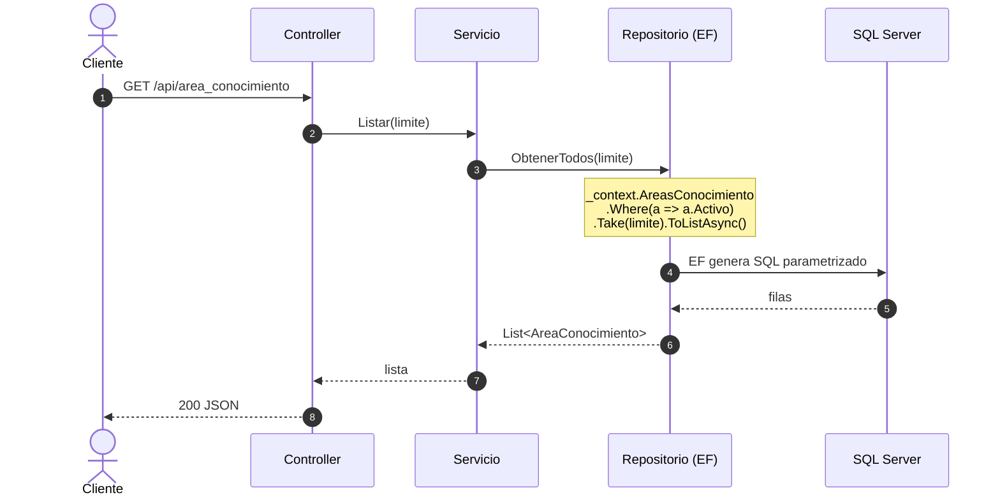
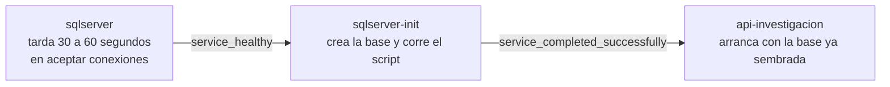

# Plan técnico — Versión 1: Catálogos del módulo Investigación (C# / ASP.NET Core + EF Core)

> El CÓMO de la [especificación](2_spec.md). Si algo de aquí contradice la
> [constitución](../../1_constitution.md), manda la constitución, **excepto en**
> el uso de ORM: el profesor ha autorizado expresamente Entity Framework Core
> en lugar de Dapper.

## 1. Stack

| Pieza | Elección | Por qué |
|---|---|---|
| Lenguaje y framework | **C# / ASP.NET Core (.NET 10)** | Artículo 2 |
| Acceso a datos | **Entity Framework Core** con `Microsoft.EntityFrameworkCore.SqlServer` | El profesor lo autorizó. Permite trabajar con LINQ y mapeo objeto-relacional, reduciendo el SQL manual. |
| Motor | **SQL Server 2022** en contenedor | El script del módulo es T-SQL |
| Documentación | **Swashbuckle** (Swagger) en `/swagger` | RNF de la spec |
| Orquestación | **Docker Compose**, tres servicios | Artículo 4 |

Paquetes permitidos:
- `Microsoft.EntityFrameworkCore.SqlServer`
- `Microsoft.EntityFrameworkCore.Tools` (opcional, para migraciones)
- `Swashbuckle.AspNetCore`

### 1.1 El stack del FRONT

| Pieza | Elección | Por qué |
|---|---|---|
| Front | **Blazor Server**, .NET 10 | Lo que pide el módulo |
| Cómo habla con la API | `HttpClient` y **JSON**, nada más | Sin biblioteca compartida |
| Estilos | **CSS escrito a mano** | Cero dependencias externas |
| Puerto | **8071** | El impar del par reservado |

## 2. Estructura de carpetas
api_investigacion/  
├── ApiInvestigacion.csproj EntityFrameworkCore.SqlServer + Swashbuckle  
├── Dockerfile imagen SDK + dotnet watch  
├── appsettings.json cadena de desarrollo  
├── Program.cs el ENSAMBLADOR: registra DbContext, repositorios, servicios  
├── Data/  
│ └── InvestigacionContext.cs el DbContext con los 6 DbSet  
├── Modelos/ 6 modelos (uno por tabla)  
│ ├── AreaConocimiento.cs  
│ ├── ObjetivoDesarrolloSostenible.cs  
│ ├── AreaAplicacion.cs  
│ ├── TerminoClave.cs  
│ ├── Universidad.cs  
│ └── LineaInvestigacion.cs  
├── Peticiones/ 6 tablas × 3 clases = 18 clases  
│ ├── AreaConocimientoCrear.cs  
│ ├── AreaConocimientoReemplazo.cs  
│ ├── AreaConocimientoActualizar.cs  
│ ├── ObjetivoDesarrolloCrear.cs  
│ ├── ...  
│ ├── LineaInvestigacionCrear.cs (sin Id, porque es IDENTITY)  
│ ├── LineaInvestigacionReemplazo.cs  
│ └── LineaInvestigacionActualizar.cs  
├── Servicios/ 6 servicios  
│ ├── IServicioAreaConocimiento.cs  
│ ├── ServicioAreaConocimiento.cs  
│ ├── IServicioObjetivoDesarrollo...  
│ ├── ...  
│ └── IServicioLineaInvestigacion.cs  
├── Repositorios/ 6 repositorios  
│ ├── IRepositorioAreaConocimiento.cs  
│ ├── RepositorioAreaConocimientoEF.cs  
│ ├── IRepositorioObjetivoDesarrollo...  
│ ├── ...  
│ └── IRepositorioLineaInvestigacion.cs  
├── Excepciones/  
│ └── NoEncontradoExcepcion.cs  
├── Controllers/ 6 controladores  
│ ├── AreaConocimientoController.cs  
│ ├── ObjetivoDesarrolloController.cs  
│ ├── AreaAplicacionController.cs  
│ ├── TerminoClaveController.cs  
│ ├── UniversidadController.cs  
│ └── LineaInvestigacionController.cs  
└── pruebas/  
├── PruebaCapas.csproj  
└── Programa.cs repositorios falsos en memoria, sin BD

### 2.1 Las carpetas del front

front_blazor/  
├── FrontInvestigacion.csproj sin paquetes de BD  
├── Program.cs registra UN servicio por recurso  
├── appsettings.json la dirección de la API  
├── Dockerfile dotnet watch  
├── Servicios/ 6 servicios, uno por tabla  
│ ├── ServicioAreaConocimiento.cs  
│ ├── ServicioObjetivoDesarrollo.cs  
│ ├── ServicioAreaAplicacion.cs  
│ ├── ServicioTerminoClave.cs  
│ ├── ServicioUniversidad.cs  
│ └── ServicioLineaInvestigacion.cs  
├── Components/  
│ ├── Layout/ marco y menú (6 enlaces)  
│ └── Pages/ 6 pantallas  
│ ├── AreasDeConocimiento.razor  
│ ├── Ods.razor  
│ ├── AreasAplicacion.razor  
│ ├── TerminosClave.razor  
│ ├── Universidades.razor  
│ └── LineasInvestigacion.razor  
└── wwwroot/app.css estilos a mano


## 3. Arquitectura en capas (con EF Core)


## 4. Decisiones de diseño aterrizadas

### 4.1 Una petición por verbo, y ahí nacen los 422

Para cada tabla, `Crear` exige todos los campos; `Reemplazo` exige los del cuerpo del PUT; `Actualizar` los tiene **todos opcionales**.

No es repetición inútil: es lo que hace que el **mismo cuerpo** dé 422 en `PUT` y 200 en `PATCH` sin un solo `if` en el servicio. La validación vive en el borde, con anotaciones (`[Required]`, `[MaxLength]`, etc.), y el negocio recibe datos ya sanos.

**Para `linea_investigacion`:** el `id` es IDENTITY, así que `LineaInvestigacionCrear`  **no incluye** el campo `Id`. Solo lleva `Nombre` y `Descripcion`.

### 4.2 El borrado lógico vive en el repositorio

`Eliminar` ejecuta (vía EF Core) `UPDATE … SET activo = 0 WHERE id = @id AND activo = 1` y devuelve las filas afectadas. **Cero filas ⇒ no existe o ya estaba inactiva ⇒ 404**, que es exactamente lo que piden C4 y C5 de la spec, sin una consulta previa.

Y **todo listado lleva `.Where(a => a.Activo)`**. Si alguna consulta lo olvida, los inactivos reaparecen: es el error más probable de esta versión.
### 4.3 El ensamblador es la sección de DI de `Program.cs`

Allí se registran el `DbContext`, los 6 repositorios y los 6 servicios con `AddScoped`. Es el único lugar donde una clase concreta aparece junto a su interfaz:

- `DbContext` → `UseSqlServer` con la cadena de conexión
- 6 repositorios: `AreaConocimiento`, `ObjetivoDesarrollo`, `AreaAplicacion`, `TerminoClave`, `Universidad`, `LineaInvestigacion`
- 6 servicios: los mismos 6 recursos

Cambiar de motor en la v2 sería cambiar `UseSqlServer` por `UseNpgsql` o `UseMySql` en esta misma sección.

### 4.4 Las excepciones se traducen a HTTP en el controlador

-   `NoEncontradoExcepcion` → 404
    
-   `ArgumentException` → 400
    
-   `DbUpdateException` (PK duplicada, violación de constraint) → 500
    
-   Cualquier otra → 500
    

El servicio lanza; el controlador traduce. Así el negocio no menciona códigos HTTP.

### 4.5 El `id` no se cambia nunca

Identifica la fila. Va en la ruta, no en el cuerpo de `PUT` ni de `PATCH` (§4 del [modelo de datos](https://5_data_model.md/)).

Para `termino_clave`, el `id` es **texto** (`termino` VARCHAR(30)). Para las demás, es `int`. Para `linea_investigacion`, el `id` lo genera la base (IDENTITY).

### 4.6 El repositorio de mentiras: qué es y para qué sirve

El criterio 7 de la spec exige probar el servicio **sin SQL Server encendido**. Eso se puede porque el servicio **no conoce el repositorio real**: solo conoce la interfaz (`IRepositorioAreaConocimiento`, etc.).

Entonces, para las pruebas, se escribe una **segunda implementación de esa misma interfaz** que en vez de hablar con la base guarda las filas en una lista en memoria:

```
// pruebas/Programa.cs — un repositorio de mentiras
public class RepositorioFalsoAreaConocimiento : IRepositorioAreaConocimiento
{
    private readonly List<AreaConocimiento> _filas = new();

    public Task<AreaConocimiento?> ObtenerPorIdAsync(int id) =>
        Task.FromResult(_filas.FirstOrDefault(a => a.Id == id && a.Activo));
    // …y así con los demás métodos
}
```
Al servicio se le entrega ese en lugar del de EF Core, y **no se entera de la diferencia**: pide lo mismo, por la misma interfaz.

**Para qué sirve, en concreto:**

-   La prueba corre **en segundos y en cualquier máquina**, sin levantar contenedores.
    
-   Prueba **las reglas de negocio**, no la base.
    
-   Y sobre todo: **es la demostración de que las capas están desacopladas de verdad.**
    

### 4.7 Quién traduce la petición en entidad

Las clases de `Peticiones/`  **no cruzan a la capa 2**. El servicio y el repositorio solo conocen `Modelos/`.

**El controlador es el traductor.** Recibe la petición ya validada por el framework, y de ahí arma lo que la capa 2 entiende: una entidad para `Crear` y `Reemplazo`, o los campos sueltos para `ActualizarParcial`.

**Por qué importa.** Una petición describe **el cuerpo de una llamada HTTP**: qué campos son obligatorios en un `POST`, cuáles opcionales en un `PATCH`. Eso es forma del protocolo, no del negocio.

La señal para detectarlo es de una línea: **si en `Servicios/` o en `Repositorios/` aparece un `using` de `Peticiones`, la capa está rota.**

### 4.8 SQL compuesto no es concatenado (en EF Core)

**Esta sección no aplica directamente**, porque con **Entity Framework Core** el SQL lo genera el ORM automáticamente a partir del LINQ. La seguridad contra inyección SQL la da el uso de **parámetros** que EF genera por defecto.

**Lo que sí aplica:** en el repositorio, nunca se concatenan valores en la construcción de consultas. Todo se hace con LINQ y EF Core lo traduce a SQL parametrizado:

### 4.9 El 422 no sale solo: hay que configurarlo

El contrato exige que un cuerpo inválido responda **422** con el sobre `{estado, mensaje, errores[]}`. **[ASP.NET](https://asp.net/) no hace eso por defecto.**

Con `[ApiController]`, cuando una anotación falla el framework corta la petición **antes de entrar al método** y responde un **400** con `ValidationProblemDetails`, que es otro formato.

Se corrige en `Program.cs`, reemplazando la fábrica de respuestas:
```
builder.Services.Configure<ApiBehaviorOptions>(opciones =>
{
    opciones.InvalidModelStateResponseFactory = contexto =>
    {
        var errores = contexto.ModelState
            .Where(e => e.Value?.Errors.Count > 0)
            .SelectMany(e => e.Value!.Errors.Select(x => x.ErrorMessage))
            .ToList();

        return new ObjectResult(new
        {
            estado = 422,
            mensaje = "Datos inválidos.",
            errores
        })
        { StatusCode = 422 };
    };
});
```
**Por qué importa tanto:** de los 11 criterios de aceptación, varios dependen del 422 — el contraste `PUT` 422 vs `PATCH` 200, y la validación como frontera.

## 5. Docker: un solo comando

Tres servicios: `sqlserver`, `sqlserver-init` (crea la base y corre el script una vez) y `api-investigacion` (código montado, `dotnet watch`).

### 5.1 El orden de arranque, que es lo que más se rompe

**Esperar a que el contenedor exista NO sirve.** El contenedor de SQL Server existe en un segundo; el motor tarda entre 30 y 60 en aceptar conexiones.
Por eso el `sqlserver` lleva un **healthcheck**:
```
  sqlserver:
    healthcheck:
      test: ["CMD-SHELL", "/opt/mssql-tools18/bin/sqlcmd -S localhost -U sa -P \"$$MSSQL_SA_PASSWORD\" -C -Q 'SELECT 1' -b"]
      interval: 10s
      timeout: 10s
      retries: 20
      start_period: 30s

  sqlserver-init:
    depends_on:
      sqlserver:
        condition: service_healthy

  api-investigacion:
    depends_on:
      sqlserver-init:
        condition: service_completed_successfully    
```
### 5.2 Lo que hay que fijar, y por qué

| Cosa | Valor | Por qué así |
|---|---|---|
| Puertos de sqlserver | `"11470:1433"` | 1433 adentro, 11470 en el host |
| Puertos de la API | `"8070:8070"` | La API escucha en 8070 adentro también |
| Puertos del front | `"8071:8071"` | El front escucha en 8071 adentro también |
| Volumen de datos | `mssqldata:/var/opt/mssql` | Directorio completo del motor |
| Volúmenes de la API | `./api_investigacion:/app` + `/app/bin` y `/app/obj` anónimos | Permite dotnet watch y evita mezclar binarios de Linux/Windows |
| Volúmenes del front | `./front_blazor:/app` + `/app/bin` y `/app/obj` anónimos | Lo mismo para el front |
| Nombre de la cadena | `ConnectionStrings__SqlServer` | Sobrescribe appsettings.json |
| Contraseña de sa | `Aplicacionweb123!` | Excepción didáctica del Artículo 7 |
| Script montado | `./db:/scripts:ro` en sqlserver-init | Solo lectura |

Lo que NO se pone: `version:` al comienzo del archivo. Compose v2 lo ignora.

### 6. Chequeo de constitución
La compuerta 2 del método: antes de pasar a las tareas se revisa la constitución artículo por artículo. Si algo no cumple, o se corrige el plan, o se enmienda la constitución.

| Artículo | Cómo lo cumple la v1 (con EF Core y 6 tablas) |
|---|---|
| **1 — Por versiones, la spec manda** | La v1 cubre las 6 tablas sin FK salientes del módulo. Sin JWT, sin autenticación. Cierra con tag `v1` |
| **2 — C#/ASP.NET Core, SQL a la vista** | **EXCEPCIÓN AUTORIZADA:** El profesor ha autorizado expresamente el uso de Entity Framework Core. El SQL lo genera EF, no se escribe a mano. Paquetes: `Microsoft.EntityFrameworkCore.SqlServer` y `Swashbuckle` |
| **3 — Tres capas con interfaces** | Controller → Servicio → Repositorio (interfaces). Solo `Program.cs` conoce clases concretas |
| **4 — Un solo comando** | `docker compose up -d --build` levanta SQL Server, la API y el front |
| **5 — La base viene dada** | Las 19 tablas se crean desde `db/investigacion.sql`; la v1 solo nombra 6 tablas |
| **6 — Borrado lógico** | `UPDATE … SET activo = 0` y `WHERE activo = 1` en todo listado (vía EF Core) |
| **7 — Secretos** | La contraseña de sa vive en el `docker-compose.yml` (excepción didáctica declarada), no en el código |
| **8 — Español y decisiones sustentadas** | Nombres, mensajes y comentarios en español; los comentarios explican el por qué |
| **9 — Contratos exactos** | `6_contracts.md` fija los 42 endpoints (7 por tabla) con todos sus códigos, incluido PUT 422 vs PATCH 200 |
| **10 — Convenciones** | Puertos 8070/8071/11470, rutas `/`, `/swagger`, `/api/{tabla}`, sobre `{tabla, limite, total, datos}` |
| **11 — Enmiendas** | Ninguna necesaria. El uso de EF Core es una desviación del Artículo 2, autorizada por el profesor |

**Complejidad justificada:** el uso de EF Core es una desviación del Artículo 2, pero el profesor lo autorizó expresamente. La v1 cubre 6 tablas porque el patrón es el mismo para todas; agruparlas en una versión reduce el tiempo total del proyecto.
