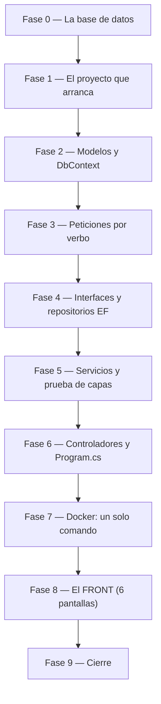

# Tareas — Versión 1: Catálogos del módulo Investigación (6 tablas + Front)

> El orden de construcción, en fases. Cada fase termina en una **compuerta**: un comando concreto que se corre y se mira. No se avanza con una fase en rojo.
>
> `[P]` marca las tareas que **no dependen entre sí** y pueden repartirse. En una construcción por capas la mayoría son secuenciales, y está bien.

---

## Fase 0 — La base de datos en pie

**Lo que YA viene dado** (artefacto, se usa tal cual — Artículo 5):
* `db/investigacion.sql` — el DDL con sus correcciones, la columna `activo` y las semillas (218, 17, 21, 0, 6, 0 filas).
* `db/init.sh` — el inicializador.

**Lo que hay que ESCRIBIR en esta fase:**
* [ ] `docker-compose.yml` con los servicios `sqlserver` y `sqlserver-init`, montando `./db` como `/scripts`. *(La API y el front se añaden en fases posteriores.)*

**Verificar:** `docker compose up -d --build`, y después este conteo:

| Tabla | Filas esperadas |
|---|---|
| `area_conocimiento` | 218 |
| `objetivo_desarrollo_sostenible` | 17 |
| `area_aplicacion` | 21 |
| `termino_clave` | 0 |
| `universidad` | 6 |
| `linea_investigacion` | 0 |

*( `termino_clave` y `linea_investigacion` quedan vacías: el catálogo de referencia no trae datos para ellas. )*

---

## Fase 1 — El proyecto que arranca y responde · *RF7*

* [ ] `ApiInvestigacion.csproj` con los paquetes:
  * `Microsoft.EntityFrameworkCore.SqlServer`
  * `Swashbuckle.AspNetCore`
* [ ] `[P]` `appsettings.json` — la cadena de conexión de desarrollo, para poder correr sin Docker. El compose la sobreescribe (`3_plan` §5).
* [ ] `Program.cs` mínimo: Swagger y el endpoint de diagnóstico `GET /` del RF7. Todavía sin ensamblador ni controladores — eso llega en la Fase 6, cuando existan las clases que registrar.
* [ ] `[P]` `Excepciones/NoEncontradoExcepcion.cs`

**Verificar:** `dotnet run --project api_investigacion` arranca, y `curl http://localhost:8070/` responde el diagnóstico con `"version":"v1"`.

> **Por qué el Program.cs va aquí y no al final:** Con el SDK Web y sin punto de entrada, el proyecto no compila: error `CS5001`. Si se deja para la última fase, ninguna compuerta anterior se puede pasar y se avanza a ciegas hasta el final.

---

## Fase 2 — Modelos y DbContext · preparación de datos

* [ ] `Modelos/AreaConocimiento.cs` — `Id` (`int`), `GranArea`, `Area`, `Disciplina`, `Activo` (`bool`). `Activo` no viaja en las respuestas.
* [ ] `Modelos/ObjetivoDesarrolloSostenible.cs` — `Id`, `Nombre`, `Categoria`, `Activo`.
* [ ] `Modelos/AreaAplicacion.cs` — `Id`, `Nombre`, `Activo`.
* [ ] `Modelos/TerminoClave.cs` — `Termino` (`string`, PK), `TerminoIngles` (nullable), `Activo`.
* [ ] `Modelos/Universidad.cs` — `Id`, `Nombre`, `Tipo`, `Ciudad`, `Activo`.
* [ ] `Modelos/LineaInvestigacion.cs` — `Id` (`int`, IDENTITY), `Nombre`, `Descripcion`, `Activo`.
* [ ] `Data/InvestigacionContext.cs` — `DbContext` con los 6 `DbSet` y la configuración de PK (`TerminoClave` usa `HasKey`), valores por defecto de `Activo` y mapeo de nombres si se desea (`snake_case` opcional).

**Verificar:** `dotnet build api_investigacion` compila sin errores.

---

## Fase 3 — Peticiones por verbo (3 por tabla = 18 clases) · *RF3, RF4, RF5*

* [ ] `[P]` Para cada tabla, crear:
  * `{Tabla}Crear.cs` — campos obligatorios para el `POST`. *(Para `linea_investigacion`: sin `Id` porque es IDENTITY)*.
  * `{Tabla}Reemplazo.cs` — campos obligatorios para el `PUT` (sin el `ID`, que va en la ruta).
  * `{Tabla}Actualizar.cs` — todos los campos opcionales para el `PATCH`.

Todas las clases llevan anotaciones `[Required]`, `[MaxLength]`, etc.

**Verificar:** `dotnet build api_investigacion` compila.

---

## Fase 4 — Interfaces y repositorios con EF Core · *RF1, RF2, RF6*

* [ ] `Repositorios/IRepositorioAreaConocimiento.cs` — métodos async:
  * `Task<List<T>> ObtenerTodosAsync(int limite)`
  * `Task<T?> ObtenerPorIdAsync(string id)` *(el ID puede ser string o int)*
  * `Task CrearAsync(T entidad)`
  * `Task<int> ActualizarAsync(string id, Dictionary<string, object> datos)`
  * `Task<int> EliminarAsync(string id)`
* [ ] Repetir para las otras 5 tablas: `IRepositorioObjetivoDesarrollo`, etc.
* [ ] `Repositorios/RepositorioAreaConocimientoEF.cs` — implementa la interfaz usando `DbContext` y LINQ. Todo listado lleva `.Where(x => x.Activo)`. El `DELETE` ejecuta `entidad.Activo = false; await _context.SaveChangesAsync();`.
* [ ] Repetir para las otras 5 tablas: `Repositorio...EF.cs`.

**Verificar:** `dotnet build api_investigacion` compila, y una lectura del código confirma que ninguna consulta olvida el `WHERE activo = 1` y que ningún `DELETE` borra físicamente.

---

## Fase 5 — Servicios y prueba de capas · *criterio 7*

* [ ] `Servicios/IServicioAreaConocimiento.cs` — interfaz del servicio (mismos métodos que el repositorio, pero con lógica de negocio).
* [ ] `Servicios/ServicioAreaConocimiento.cs` — reglas de negocio:
  * Valida `limite > 0` → lanza `ArgumentException`.
  * Valida que el `ID` no esté vacío.
  * Para `PATCH`, si el diccionario está vacío → `ArgumentException`.
  * Si el repositorio devuelve `null` → lanza `NoEncontradoExcepcion`.
* [ ] Repetir para las otras 5 tablas (los servicios son muy parecidos; se puede copiar y cambiar el tipo).
* [ ] `pruebas/PruebaCapas.csproj` y `pruebas/Programa.cs`:
  * Implementar repositorios falsos en memoria para cada una de las 6 tablas.
  * Probar el servicio correspondiente: crear, listar, obtener, actualizar, eliminar.
  * Verificar que las excepciones se lanzan correctamente.

**Verificar:** `dotnet run --project api_investigacion/pruebas` pasa **sin SQL Server encendido**. Si exige la base, las capas no están desacopladas.

---

## Fase 6 — Controladores y Program.cs · *todos los RF*

* [ ] `Controllers/AreaConocimientoController.cs` — 7 endpoints:
  * `GET /api/area_conocimiento[?limite=N]`
  * `GET /api/area_conocimiento/{id}`
  * `POST /api/area_conocimiento`
  * `PUT /api/area_conocimiento/{id}`
  * `PATCH /api/area_conocimiento/{id}`
  * `DELETE /api/area_conocimiento/{id}`
  * Cada método traduce excepciones a códigos HTTP (404, 400, 500).
* [ ] Repetir para las otras 5 tablas: `ObjetivoDesarrolloController`, etc. *(Para `linea_investigacion`: el `POST` recibe `LineaInvestigacionCrear` sin `Id` y construye la entidad sin asignar `Id`)*.
* [ ] `Program.cs` crece:
  * Registrar `DbContext` con `UseSqlServer`.
  * Registrar los 6 repositorios y los 6 servicios con `AddScoped`.
  * Configurar la respuesta `422` personalizada (`InvalidModelStateResponseFactory`).
  * Mapear controladores.

**Verificar:** `dotnet run` y los endpoints responden contra la base que ya está en pie: `curl http://localhost:8070/api/area_conocimiento` devuelve 218, `curl http://localhost:8070/api/linea_investigacion` devuelve 0.

---

## Fase 7 — Docker: un solo comando · *criterio 1*

* [ ] `api_investigacion/Dockerfile` — imagen SDK con `dotnet watch`, puerto 8070.
* [ ] `docker-compose.yml` — agregar el servicio `api-investigacion`:
  * Volumen: `./api_investigacion:/app` + volúmenes anónimos para `bin/` y `obj/`.
  * Variable de entorno: `ConnectionStrings__SqlServer` apuntando a `sqlserver,1433`.
  * `depends_on`: `sqlserver-init` con `condition: service_completed_successfully`.

**Verificar:** `docker compose down -v` y luego `docker compose up -d --build` deja la API funcionando desde cero. `curl http://localhost:8070/` responde el diagnóstico.

---

## Fase 8 — El FRONT: la otra mitad de la versión · *RF8, criterios 8 a 11*

Va **después** de que la API responda y **antes** del cierre. No es un añadido opcional: sin esta fase la versión está a medias.

| # | Tarea | Archivo |
|---|---|---|
| **8.1** | Proyecto Blazor Server, sin ningún paquete de acceso a datos | `front_blazor/FrontInvestigacion.csproj` |
| **8.2** | `ServicioAreaConocimiento`: 6 métodos (`Listar`, `Obtener`, `Crear`, `Reemplazar`, `Actualizar`, `Eliminar`) | `Servicios/ServicioAreaConocimiento.cs` |
| **8.3** | Repetir para las otras 5 tablas: `ServicioObjetivoDesarrollo`, `ServicioAreaAplicacion`, `ServicioTerminoClave`, `ServicioUniversidad`, `ServicioLineaInvestigacion` | `Servicios/` |
| **8.4** | El tipo `Resultado<T>` y la traducción de errores (sobre 422, 400, 404, 500) a mensajes de usuario | `Servicios/ServicioBase.cs` o cada servicio |
| **8.5** | El marco y el menú, con un enlace por cada una de las 6 pantallas | `Components/Layout/NavMenu.razor` |
| **8.6** | Las 6 pantallas del CRUD, cada una con su formulario y los dos botones de guardar (completo / parcial) | `Components/Pages/AreasDeConocimiento.razor`, `Ods.razor`, `AreasAplicacion.razor`, `TerminosClave.razor`, `Universidades.razor`, `LineasInvestigacion.razor` |
| **8.7** | Los estilos, escritos a mano (sin Bootstrap ni CDN) | `wwwroot/app.css` |
| **8.8** | El servicio `front-blazor` en el compose, en el puerto 8071, sin `depends_on: sqlserver` | `docker-compose.yml` |
| **8.9** | Dockerfile para el front (imagen SDK, `dotnet watch`, puerto 8071) | `front_blazor/Dockerfile` |
| **8.10** | La prueba de humo del front | `pruebas_humo/humo_front.py` |

**Verificación de la fase — las cuatro, y la última es la que cuenta:**
* [ ] `http://localhost:8071/areas-de-conocimiento` muestra las 218 filas.
* [ ] El recorrido a mano de `7_quickstart` §4.2 se hizo para cada una de las 6 pantallas: agregar, los dos botones, retirar.
* [ ] `python pruebas_humo/humo_front.py` da todo en verde.
* [ ] **Con `docker compose stop api-investigacion`, la pantalla sigue en pie con su aviso y sin un solo dato en todas las pantallas.**

> **La 8.10 tiene un límite declarado:** Blazor Server manda los clics por una conexión persistente, así que un guion no puede llenar el formulario. Por eso hay dos verificaciones y no una: la automática y el recorrido a mano.

---

## Fase 9 — Cierre

* [ ] Correr el smoke test completo de `7_quickstart.md` (API + Front).
* [ ] Pasar y firmar `9_checklist.md`.
* [ ] `postman/coleccion_v1.postman_collection.json` y el `README.md`.
* [ ] Commit y tag `v1`.

**Verificar:** Los 11 criterios de aceptación en verde, con la salida real pegada. Sin eso no hay tag.

---

### Nota sobre la repetición
Las fases 2, 3, 4, 5 y 6 requieren repetir el mismo patrón para 6 tablas. No es trabajo de más: es la decisión de tener un recurso por controlador, servicio y repositorio (Artículo 10.1). La repetición es el precio consciente de que cada tabla pueda tener sus propias reglas y validaciones. Para agilizar, se puede generar el código con plantillas o usar
